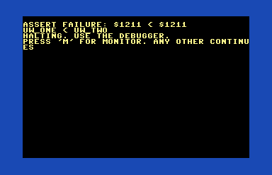
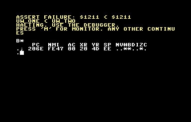

# Prog8 debugging assert routine

This module provides a debug `assert` routine that can be used to verify
an expected condition and halt if validation fails.  It is currently setup to
allow dropping into the monitor on Commander X16 and C64.
In the included example setup a monitor is loaded into $2000 on C64.




# Usage

You need to `%import debug` and then call `debug.assert()` with appropriate arguments.
You can call assert with two uword or ubyte arguments.  You then need to provide a check
like `debug.EQ` to assert the two values should be equal. Then you provide a string to
print with this message.  This string should include meaningful information
about which block/sub-routine/line to you the developer.  These routines should not
be used in production code, just during development and debugging.


```
debug {
    ...
    const ubyte EQ = 1
    const ubyte NE = 2
    const ubyte GT = 3
    const ubyte GE = 4
    const ubyte LT = 5
    const ubyte LE = 6
    ...
    sub assert(uword one, uword two, ubyte check, str msg) -> bool {
    ...
}
```

In `src/main.p8` is an example usage with some random failures added.  Check it out.

Example:
```Prog8
%import debug
main {
    sub start() {
        uword ptr1 = $1234
        uword ptr2 = $5678
        ; should succeed
        void debug.assert($10, $20, debug.NE, "$10 != $20")
        ; should fail
        void debug.assert($1000, $2000, debug.EQ, "start: 2nd: $1000 == $2000")
        void debug.assert(ptr1, ptr2, debug.NE, "start: 3rd: ptr1 != ptr2")
    }
}
```
