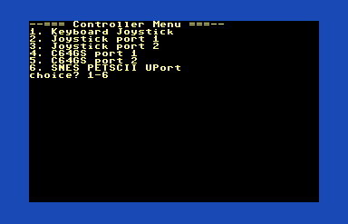
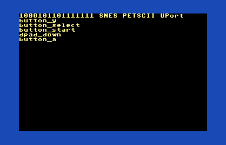

# Prog8 Input / Joystick library

This is the start of an input / joystick library for Prog8.  Currently it just supports C64.
It is meant to be similar to the Commander X16 kernal `joystick_get()` routine which
returns a SNES controller 16-bit value.

It supports reading the C64 control port 1 or 2 as well as the PETSCII Robots UserPort
adapter with a SNES controller.  There are routines to return the traditional C64
format ubyte or a SNES uword.

This library is setup to automatically populate the array of available devices by just
importing additional device drivers.

## Usage

The `input.get()` routine supports these devices depending on which files are imported:

0. virtual keyboard controller (not really supported, just checks WASD + return)
1. control port 1 classic joystick
3. control port 1 joystick with 2 or 3 buttons. ( using POTX & POTY for 2&3)
2. control port 2 classic joystick
4. control port 2 joystick with 2 or 3 buttons. ( using POTX & POTY for 2&3)
5. SNES controller plugged into the PETSCII Robots UserPort adapter.

The `input.get()` routine returns a uword in the standard SNES format.  The C64
control port joystick values are remapped into the appropriate spot to match the SNES, but
missing most of the buttons of course.

See [../joystick] for support that includes ubyte only data in the classic C64 format.

Here is reading joystick 1 (control port 1, standard joystick, but SNES uword format)
```prog8
%import input
%import input_joykey
%import input_joystick
%import input_petscii_snes
main {
    sub start() {
        uword pins = input.get(1)
    }
}
```

Here is getting the name for joystick 1
```prog8
%import input
%import input_joykey
%import input_joystick
%import input_petscii_snes
%import textio
main {
    sub start() {
        ^^input.Device dev = input.getdev(1)
        txt.print(dev.name)
    }
}
```

# Testing

You can use `src/tester.p8` (`make` generates `build/tester.prg`) to test the different joystick configurations.  Just select it from the menu.  Then press buttons on the controller to see
the bits change and decode the buttons.  Press the keyboard spacebar to go back to the menu.

The `tester.prg` menu:


Using `tester.prg` to read the PETSCII Robots SNES adapter:


