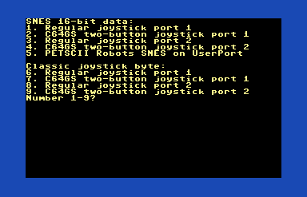
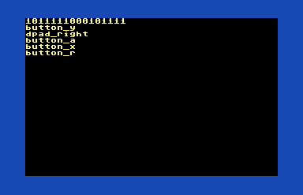

# Prog8 Joystick library

This is the start of a joystick library for Prog8.  Currently it just supports C64.
It is meant to be similar to the Commander X16 kernal `joystick_get()` routine which
returns a SNES controller 16-bit value.

It supports reading the C64 control port 1 or 2 as well as the PETSCII Robots UserPort
adapter with a SNES controller.  There are routines to return the traditional C64
format ubyte or a SNES uword.

## Usage

The `joystick.get()` routine supports these devices:
0. virtual keyboard controller (not yet supported)
1. control port 1 classic joystick
2. control port 2 classic joystick
3. control port 1 joystick with 2 or 3 buttons. ( using POTX & POTY for 2&3)
4. control port 2 joystick with 2 or 3 buttons. ( using POTX & POTY for 2&3)
5. SNES controller plugged into the PETSCII Robots UserPort adapter.

The `joystick.get()` routine returns a uword in the standard SNES format.  The C64
control port joystick values are remapped into the appropriate spot to match the SNES, but
missing most of the buttons of course.

The `joystick.get_ub()` routine supports these devices:
0. virtual keyboard controller (not yet supported)
1. control port 1 classic joystick
2. control port 2 classic joystick
3. control port 1 joystick with 2 or 3 buttons. ( using POTX & POTY for 2&3)
4. control port 2 joystick with 2 or 3 buttons. ( using POTX & POTY for 2&3)

The `joystick.get_usb()` routine returns a ubyte in the classic C64 format.  For the
multi-button (C64GS style) joysticks, the POTX button is mapped to bit 5 and POTY to bit 6.

Here is reading joystick 1 (control port 1, standard joystick, but SNES uword format)
```prog8
%import joystick
main {
    sub start() {
        uword pins = joystick.get(1)
    }
}
```

Here is reading joystick 1 (control port 1, standard joystick, normal C64 byte)
```prog8
%import joystick
main {
    sub start() {
        ubyte pins = joystick.get_ub(1)
    }
}
```

# Testing

You can use `src/tester.p8` (`make` generates `build/tester.prg`) to test the different joystick configurations.  Just select it from the menu.  Then press buttons on the controller to see
the bits change and decode the buttons.  Press a key on the keyboard to go back to the menu.

The `tester.prg` menu:


Using `tester.prg` to read the PETSCII Robots SNES adapter:

